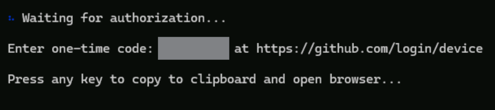

[← Previous: Prerequisites](01-prerequisites.md) | [Next: Getting Started →](03-getting-started.md)

---

# Before You Begin — Login & Launch

## 0. Start Docker

Type for **Docker Desktop** in the Search and start your Docker instance. 

> [!TIP]
> 🏠 **At home?** Make sure Docker Desktop is installed and running on your machine. Verify with `docker version` in a terminal.

## 1. Log in to Azure
Open a terminal, use the shortcut (Ctrl + Shift + 4) to open Powershell and complete these steps.

```bash
az login
```

When the sign-in pop-up shows up, select **Work or school account** and select **Continue**. Input the username found in the **Resources** tab of your Skillable VM by clicking on the keyboard icon and select **Next**. Then, input the TAP found in the same tab by clicking on the keyboard icon to complete sign-in.

> [!TIP]
> 🏠 **At home?** Open any terminal (the Ctrl+Shift+4 shortcut is specific to the lab VM). Use your own Azure subscription credentials — you need at least **Contributor** access. Skip the Resources tab and TAP instructions — just run `az login` and authenticate normally.

> ⚠️ **Do NOT select "Microsoft account" (personal/consumer).** The login page may show multiple options — always select **Work or school account**. Selecting the wrong option will result in access-denied errors.

> ⚠️ **Duplicate users:** In some lab environments, you may see two different user accounts listed. If this happens, use the credentials shown in the **Resources** tab and ignore any additional accounts. The Resources tab is the source of truth.

When the terminal prompts you for subscription selection, hit **Enter** for no changes. 

## 2. Log in to Azure Developer CLI

```bash
azd auth login
```

Select the Azure account from the previous step and complete authentication. 

## 3. Log in to GitHub

Open this link in the browser: <https://github.com/enterprises/skillable-events/sso>. Follow the prompts to authenticate. Select the Azure account you just authenticated to. 

> [!TIP]
> 🏠 **At home?** Skip the enterprise SSO link above. Instead, run `gh auth login` in your terminal and follow the prompts to authenticate with your personal GitHub account. Verify with `gh auth status`.

## 4. Log in to GitHub Copilot CLI
To ensure you are using the latest version, perform the following command to update Copilot CLI. 

```bash
winget upgrade github.copilot
```

> [!TIP]
> 🏠 **At home on macOS or Linux?** Install GitHub Copilot CLI following the instructions at [GitHub Copilot in the CLI](https://docs.github.com/en/copilot/github-copilot-in-the-cli). The `winget` command above is Windows-only.

Once Copilot CLI is updated to the latest version, enter the following command: 

```bash
copilot
```
This opens the interactive Copilot CLI session. All "Say to Copilot" prompts in this lab are typed here. **Keep this session open for the rest of the lab** — this is where you'll interact with AI skills.

> 💡 **Terminal vs. Copilot:** Throughout this lab, you'll run commands in two places. **Copilot CLI** is for AI-driven prompts (e.g., "Deploy my app to Azure"). **Terminal commands** (prefixed with `!` in Copilot) are for shell operations like `curl`, `az`, and `git`. When in doubt, you can run any terminal command inside Copilot by prefixing it with `!`.

```bash
/login
```
Follow the instructions in Copilot to complete authorization using the signed-in account.



## 5. Install the Azure Skills Plugin

1. Add the Microsoft marketplace:
   ```
   /plugin marketplace add microsoft/azure-skills
   ```

2. Install the Azure plugin:
   ```
   /plugin install azure@azure-skills
   ```

3. Reload azure mcp:
   ```
   /mcp reload
   ```

4. To update later:
   ```
   /plugin update azure@azure-skills
   ```

> 💡 **MCP tools vs. Azure skills:** The Azure MCP server provides **MCP tools** — low-level operations like listing resources, querying logs, and managing deployments. Azure **skills** are higher-level prompt instructions that chain these tools together with domain knowledge (e.g., `azure-diagnostics` knows how to follow a triage reasoning chain). This lab uses both: skills drive the workflow, MCP tools execute the Azure operations.

✅ **Checkpoint:** You're logged into GitHub and Azure, Copilot CLI is running, Azure skills and Azure MCP Server are installed.

---

**Next:** [Create the Starter App →](03-getting-started.md)

---

[← Previous: Prerequisites](01-prerequisites.md) | [Next: Getting Started →](03-getting-started.md)
