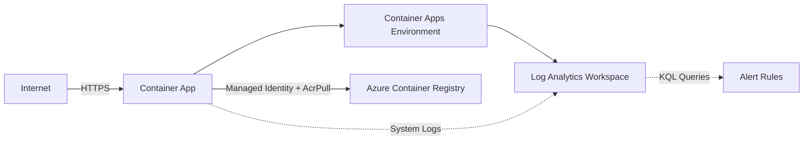

# End-to-End Agentic DevOps with Azure MCP — Ship, Harden, Break, Investigate

**Hands-On Lab (30 min) | Level: 300**

AI can deploy your app to Azure in 5 minutes. But should you trust what it built? In this lab, you'll use GitHub Copilot CLI with Azure skills to deploy a live Container App — then put on your architect hat and evaluate the AI's decisions. You'll review generated Bicep, identify what's missing for production, direct the AI to harden the deployment, break the app on purpose, and run a full forensic investigation — all without opening the Azure Portal.

> 💡 **AI responses may vary** from what's described in this guide. Focus on which skills activate and the reasoning patterns, not exact output. The prompts are tested, but AI is non-deterministic — your results may look slightly different.

### Target Architecture



---

## What You'll Learn

- How Azure **skills** chain together — one prompt can trigger `prepare` → `validate` → `deploy` automatically
- Where AI-generated infrastructure gets you to 80% — and the production gaps you need to close
- How to critically review AI-generated Bicep, Dockerfiles, and architecture diagrams
- How skills like `azure-diagnostics` and `azure-observability` reason through problems: triage patterns, log correlation, KQL generation
- When to trust the AI's decisions and when to override them

## Skills Used — 7 Skills Across 4 Scenarios

| # | Skill | What It Does | Scenario |
|---|---|---|---|
| 1 | `azure-prepare` | Scans your codebase, generates IaC + Docker + config from skill references | 1A: Ship |
| 2 | `azure-validate` | Pre-flight checks: Bicep compilation, Docker status, subscription access | 1A: Ship |
| 3 | `azure-deploy` | Runs `azd up` — provisions infrastructure + builds + deploys | 1A: Ship |
| 4 | `azure-rbac` | Finds least-privilege roles from Azure docs, generates assignment commands | 1B: Harden |
| 5 | `azure-resource-visualizer` | Queries Resource Graph, maps relationships, generates Mermaid diagrams | 2: See |
| 6 | `azure-diagnostics` | Pulls system logs, follows diagnostic reasoning chain to root cause | 3: Break |
| 7 | `azure-observability` | Writes KQL queries from natural language, creates alert rules | 4: Investigate |

---

## Prerequisites

Run the setup script to install and validate everything:

```powershell
powershell -ExecutionPolicy Bypass -File setup-lab.ps1
```

Or validate an existing setup:

```powershell
powershell -ExecutionPolicy Bypass -File setup-lab.ps1 -ValidateOnly
```

**What you need:**

- Azure subscription with Contributor access
- GitHub Copilot CLI (see setup below)
- [Node.js 22+](https://nodejs.org/) · [Docker Desktop](https://www.docker.com/products/docker-desktop/) (must be running) · [Git](https://git-scm.com/)
- [Azure CLI](https://learn.microsoft.com/cli/azure/install-azure-cli) with Bicep (`az bicep install`)
- [Azure Developer CLI (azd)](https://learn.microsoft.com/azure/developer/azure-developer-cli/install-azd)

**Quick manual check:**
```
node -v && docker version --format "{{.Server.Version}}" && az version -o tsv --query '"azure-cli"' && azd version && az account show --query name -o tsv
```

### Add the Azure MCP Server

The Azure MCP server gives Copilot CLI direct access to your Azure resources via MCP tools. [Full docs →](https://learn.microsoft.com/azure/developer/azure-mcp-server/how-to/github-copilot-cli)

1. Start the GitHub Copilot CLI in interactive mode:
   ```
   copilot
   ```

2. Run the MCP server configuration command:
   ```
   /mcp add
   ```

3. Fill in the configuration form:

   | Field | Value |
   |-------|-------|
   | **Server Name** | `azure-mcp` |
   | **Server Type** | `1` (Local) |
   | **Command** | `npx -y @azure/mcp@latest server start` |
   | **Environment Variables** | _(leave blank — uses Azure CLI auth)_ |
   | **Tools** | `*` |

4. Press **Ctrl+S** to save, then **Esc** to close.

5. Verify the connection:
   ```
   /mcp show
   ```
   You should see `azure-mcp` listed with status `● connected`.

### Install the Azure Skills Plugin

Azure skills give Copilot CLI specialized knowledge for Azure workflows — deployment, diagnostics, RBAC, observability, and more. This lab uses 7 Azure skills.

1. Add the Microsoft marketplace:
   ```
   /plugin marketplace add microsoft/github-copilot-for-azure
   ```

2. Install the Azure plugin:
   ```
   /plugin install azure@github-copilot-for-azure
   ```

3. To update later:
   ```
   /plugin update azure@github-copilot-for-azure
   ```

> 💡 **MCP tools vs. Azure skills:** The Azure MCP server provides **MCP tools** — low-level operations like listing resources, querying logs, and managing deployments. Azure **skills** are higher-level prompt instructions that chain these tools together with domain knowledge (e.g., `azure-diagnostics` knows how to follow a triage reasoning chain). This lab uses both: skills drive the workflow, MCP tools execute the Azure operations.

---

## Getting Started — Create the Starter App

Create a new folder and navigate into it — all subsequent commands assume you're in this directory:

```bash
mkdir devops-dashboard && cd devops-dashboard
```

Add these two files:

**server.js**
```javascript
const http = require("http");
const port = process.env.PORT || 3000;
const startTime = new Date().toISOString();

const routes = {
  "/health": () => ({ status: "healthy", uptime: process.uptime() }),
  "/api/status": () => ({
    service: "devops-dashboard",
    version: "1.0.0",
    region: process.env.AZURE_REGION || "local",
    deployed: startTime,
    runtime: { node: process.version, platform: process.platform, memory: Math.round(process.memoryUsage().rss / 1024 / 1024) + "MB" }
  }),
  "/api/deployments": () => ({
    latest: { id: "azd-" + Date.now(), status: "succeeded", timestamp: new Date().toISOString() },
    environment: process.env.NODE_ENV || "development"
  })
};

const server = http.createServer((req, res) => {
  const handler = routes[req.url];
  res.writeHead(200, { "Content-Type": "application/json" });
  res.end(JSON.stringify(handler ? handler() : { service: "devops-dashboard", endpoints: Object.keys(routes) }));
});

server.listen(port, () => console.log(`DevOps Dashboard API running on port ${port}`));
```

**package.json**
```json
{ "name": "devops-dashboard", "version": "1.0.0", "scripts": { "start": "node server.js" } }
```

Then initialize the project:
```bash
npm install --package-lock-only
git init && git add -A && git commit -m "init"
```

Expected output: `added 0 packages` from npm, then `[main (root-commit) ...] init` from git.

> ⚠️ **Important:** When the AI creates your AZD environment, use a name **without hyphens** (e.g., `mcplab1234`, not `mcp-lab-1234`). Azure Container Registry names must be alphanumeric only — hyphens in the environment name will cause deployment to fail.

> ⚠️ **AZD subscription alignment:** AZD maintains its own subscription config, separate from `az account show`. After `azd init`, run `azd env set AZURE_SUBSCRIPTION_ID $(az account show --query id -o tsv)` to ensure AZD uses the same subscription you're logged into.

✅ **Checkpoint:** Run `git log --oneline` — you should see one commit. Run `node server.js` — visit `http://localhost:3000` and confirm you see JSON output. Press Ctrl+C to stop.

---

## Scenario 1 — Ship It & Harden It (~8 min)

AI can scaffold your Azure deployment in minutes. But would you push AI-generated Bicep to production without reviewing it?

### Part A — Ship It (~5 min)

**Say to Copilot:**

> "I have a Node.js API in this folder. Deploy it to Azure Container Apps."

This single prompt triggers a **three-skill chain** — watch Copilot invoke each one:

**1️⃣ `azure-prepare` activates first.** Watch how it:
- Scans your workspace — finds `package.json`, classifies it as a Node.js HTTP API
- Chooses Container Apps as the hosting target (do you agree with that choice over App Service or Functions?)
- Generates four files: `Dockerfile`, `azure.yaml`, `infra/main.bicep`, `infra/app/api.bicep`
- Creates an AZD environment and sets your subscription + region

> 💡 **Skill spotlight:** `azure-prepare` doesn't just generate files — it reads skill references for your language runtime, Bicep patterns, and AZD conventions. Open the generated `Dockerfile` and `infra/app/api.bicep` — these came from skill reference templates, not generic boilerplate.

**2️⃣ `azure-validate` activates next.** It runs pre-flight checks:
- Compiles Bicep (`az bicep build`) — catches syntax errors before deployment
- Verifies Docker is running — deployment will fail without it
- Confirms your subscription access and that the resource group name isn't taken

**3️⃣ `azure-deploy` activates last.** It runs `azd up --no-prompt`, which:
- Provisions ACR, Container Apps Environment, Log Analytics, and the app
- Builds your Docker image and pushes it to ACR
- Deploys the container and returns a live HTTPS endpoint

**Verify it works:**
```bash
curl <your-endpoint-url>
```

> 💡 **Finding your endpoint URL:** If the URL scrolled off screen, run `azd env get-values | grep SERVICE_API` or ask Copilot: "What's the URL for my Container App?" The URL looks like `https://<app-name>.<region>.azurecontainerapps.io`.

> 💡 **First request may be slow:** The first request after deploy can take 10-15 seconds while the new revision activates. This is normal — retry after a moment.

**End state:** A live HTTPS endpoint returning JSON. Three skills, one prompt. But it's deployed, not production-ready.

✅ **Checkpoint:** `curl <your-endpoint-url>/health` returns `{"status":"healthy",...}`. Note your app name and resource group — you'll need them in Scenario 3. Run: `azd env get-values` and note `AZURE_RESOURCE_GROUP` and your Container App name.

### Part B — Harden It (~3 min)

Open `infra/app/api.bicep`. What's missing for production?

| Gap | Why It Matters | Severity |
|---|---|---|
| **No managed identity for ACR pull** | Container App uses admin credentials to pull images. Security finding. | High |
| **No VNet integration** | Container Apps Environment is on a public network. No isolation. | Medium |
| **No diagnostic settings** | Platform metrics aren't forwarded. You'd miss CPU/memory alerts. | Medium |
| **No health probe configured** | Defaults to TCP probes. Your app has `/health` — it should use it. | Low |

**Say to Copilot:**

> "My Container App is pulling images from ACR using admin credentials. Switch it to use managed identity with AcrPull role."

**4️⃣ `azure-rbac` activates.** Watch how it:
- Searches Azure RBAC documentation for the minimum-privilege role matching "pull images from ACR"
- Identifies `AcrPull` (not `Contributor`, not `AcrPush` — least privilege)
- Generates the exact `az role assignment create` command with your resource names
- Explains the identity chain: Container App → System-Assigned Managed Identity → AcrPull role → ACR

> 💡 **300-level insight:** The AI chose `AcrPull` over `Contributor`. If it had chosen `Contributor`, would you have caught it? That's the gap between "AI-generated" and "production-reviewed."

> ℹ️ **Note:** The role assignment is created, but the Container App configuration would need a re-deploy to switch from admin credentials to managed identity pull. For this lab, understanding the pattern is the goal — you don't need to re-deploy.

**Other production gaps worth discussing:** Key Vault for secrets management (not just environment variables), VNet integration for network isolation (adds ~3 min provisioning time), and error handling in the app code (`SIGTERM` graceful shutdown, proper HTTP status codes). These are out of scope for 30 minutes but essential in production.

✅ **Checkpoint:** The `az role assignment create` command succeeded. You can verify with: `az role assignment list --scope <acr-id> --query "[?roleDefinitionName=='AcrPull']" -o table`.

**Takeaway:** The AI built a working deployment across 3 skills. You identified what "working" doesn't mean "production-ready," and used a 4th skill to start hardening.

---

## Scenario 2 — See It & Evaluate It (~5 min)

Architecture diagrams are either stale, wrong, or don't exist. AI can generate them instantly — but are they accurate?

### Part A — Generate the Diagram (~2 min)

**Say to Copilot:**

> "Visualize the resources in my resource group as an architecture diagram."

**5️⃣ `azure-resource-visualizer` activates.** Watch how it:
- Queries Azure Resource Graph to inventory every resource in your resource group
- Maps relationships: Container App → Container Apps Environment → Log Analytics, Container App → ACR
- Generates a Mermaid diagram with labeled subgraphs, resource types, and connection arrows
- Outputs renderable markdown you can paste into any Mermaid viewer

> 💡 **Skill spotlight:** The visualizer doesn't just list resources — it infers relationships from resource properties (e.g., `environmentId` links the Container App to its Environment). It's reading the ARM resource model, not guessing from names.

### Part B — Evaluate the Diagram (~3 min)

Open the generated markdown and review critically:

- Did it capture all 4 resources (Container App, Environment, ACR, Log Analytics)?
- Are the relationships correct? Does it show ACR → Container App pull?
- What's missing that you'd need for a production architecture review?

**Say to Copilot:**

> "What's missing from this architecture for a production deployment?"

Compare the AI's recommendations against your own findings from Scenario 1B.

✅ **Checkpoint:** You have a Mermaid diagram showing at least 4 resources (Container App, Environment, ACR, Log Analytics) with connection arrows. To render it: copy the Mermaid block from Copilot's output and paste into [mermaid.live](https://mermaid.live) or use VS Code with a Mermaid extension.

**Takeaway:** `azure-resource-visualizer` is excellent for discovery ("what exists right now?") but requires expert review for documentation ("is this complete and accurate?"). The diagram reflects deployed state, not desired state — that gap is your job.

---

## Scenario 3 — Break It & Triage It (~5 min)

It's 2 AM. Your app returns 503. You open a terminal. Pay attention to the AI's diagnostic reasoning chain, not just the answer.

### Introduce the Failure

Replace `<app>` and `<rg>` with your actual Container App name and resource group from Scenario 1A (run `azd env get-values` if you need to find them):

```bash
az containerapp ingress update --name <app> -g <rg> --target-port 9999
```

> ⏱️ **This command takes ~2 minutes** while the new Container Apps revision activates. This is expected — don't Ctrl+C.

Hit the endpoint — you'll get `503 Service Unavailable`.

### Diagnose with AI

**Say to Copilot:**

> "My Container App is returning 503. What's wrong?"

**6️⃣ `azure-diagnostics` activates.** Watch the triage chain:

1. **Hypothesis formation** — the skill considers multiple failure modes: app crash? ingress misconfiguration? bad image? unhealthy environment?
2. **Log retrieval** — pulls Container App system logs using `az containerapp logs show --type system`
3. **Log correlation** — finds `Reason: Pending:PortMismatch` — *"TargetPort 9999 does not match listening port 3000"*
4. **Config verification** — cross-references ingress config (port 9999) against the container's `PORT` env var (3000)
5. **Root cause + fix** — delivers the exact CLI command to restore the correct port

> 💡 **Skill spotlight:** `azure-diagnostics` doesn't just search logs for errors — it follows a diagnostic reasoning chain. It starts broad (what could cause 503?), narrows via evidence (system logs show PortMismatch), and confirms with config data. This is the same triage pattern a senior SRE would follow.

### Apply the Fix

Run the suggested fix command. It will be something like:
```bash
az containerapp ingress update --name <app> -g <rg> --target-port 3000
```

Verify recovery → `200 OK`.

✅ **Checkpoint:** `curl <your-endpoint-url>/health` returns `{"status":"healthy",...}` again.

**Takeaway:** One natural language question → `azure-diagnostics` activated → root cause + fix in ~30 seconds. The skill did the log correlation you'd normally do manually in the portal.

---

## Scenario 4 — Investigate It & Operationalize It (~10 min)

The incident is resolved. Now: "How long was it down? How do we prevent it next time?"

> ⏱️ **Log ingestion latency:** Container App system logs take ~5 minutes to appear in Log Analytics. If you completed Scenario 3 quickly, the data should be available by now — if not, wait a minute and retry.

### Part A — Post-Mortem via KQL (~5 min)

**Say to Copilot:**

> "Query the Log Analytics workspace for my Container App. Show me what happened during the port mismatch incident."

**7️⃣ `azure-observability` activates.** Watch how it builds the investigation:

1. **Workspace discovery** — locates your Log Analytics workspace from the resource group
2. **Table exploration** — queries `ContainerAppSystemLogs_CL` to find available event types
3. **Event distribution** — runs a KQL `summarize count() by Reason_s` to show the breakdown: PortMismatch events, ReplicaUnhealthy impact, RevisionUpdate recovery
4. **Incident timeline** — writes a KQL query with `earliest(TimeGenerated)` and `latest(TimeGenerated)` to calculate exact downtime duration
5. **Recovery confirmation** — checks for `RevisionReady` events to prove the fix worked

> 💡 **Skill spotlight:** `azure-observability` writes KQL *for you* based on natural language. Review the generated queries — would you have written them differently? The skill uses `has` instead of `==` for string matching in KQL, which is more resilient to log format changes.

**Review the KQL the AI wrote.** Copy a query and modify it — try adding a `| where TimeGenerated > ago(1h)` filter or changing the `summarize` to include `bin(TimeGenerated, 5m)` for a time-series view. Run modified queries in the Copilot CLI or paste them into the Azure Portal's Log Analytics query editor.

✅ **Checkpoint:** You've seen KQL queries showing the PortMismatch events, the incident timeline, and the recovery confirmation.

### Part B — Operationalize It (~5 min) ⭐ _Bonus — complete if time allows_

**Say to Copilot:**

> "Create a KQL alert rule that fires when PortMismatch events appear in the Container App system logs."

**`azure-observability` continues.** It:
- Writes the alert KQL query targeting `ContainerAppSystemLogs_CL`
- Generates the full `az monitor scheduled-query create` command with threshold, frequency, severity, and action group
- Explains each parameter so you can tune it (e.g., evaluation frequency, number of violations before firing)

> ⚠️ **Prerequisite:** The `scheduled-query` CLI extension must be installed: `az extension add --name scheduled-query --yes`

**Then ask:**

> "What other alert rules should I have for a production Container App?"

The AI suggests: replica health, restart loops, high latency, 5xx spikes, memory utilization — each with the KQL pattern you'd need.

✅ **Checkpoint:** `az monitor scheduled-query list -g <rg> -o table` shows your alert rule.

**Takeaway:** Two prompts, one skill (`azure-observability`), and you went from "the incident is over" to "this class of incident will page me next time." The real 300-level value: you can now read and modify these KQL queries yourself.

---

## Timing Summary

| Scenario | Duration | Skills Invoked | Skill Count |
|---|---|---|---|
| 1. Ship & Harden | ~8 min | `azure-prepare` → `azure-validate` → `azure-deploy` + `azure-rbac` | 4 |
| 2. See & Evaluate | ~5 min | `azure-resource-visualizer` | 1 |
| 3. Break & Triage | ~5 min | `azure-diagnostics` | 1 |
| 4. Investigate & Operationalize | ~10 min | `azure-observability` | 1 |
| **Total** | **~28 min** | **7 unique skills** | **7** |

---

## Cleanup

When you're done, tear everything down:

```bash
azd down --no-prompt --purge
```

If that times out:
```bash
az group delete --name rg-<your-env-name> --yes --no-wait
```

> ⚠️ **Cost warning:** If you skip cleanup, the Container Apps Environment and ACR will incur charges (~$5-12/month). Set a calendar reminder to verify resources are deleted.

**Estimated lab cost per attendee (if cleaned up immediately):** ~$0.20. If left running for 30 days: ~$8-12.

---

## Troubleshooting

### ACR name contains hyphens → Deployment fails
**Symptom:** `azd up` fails with an error about invalid ACR name.
**Cause:** ACR names must be alphanumeric. Hyphens in your AZD environment name propagate to the registry name.
**Fix:** Use an environment name without hyphens (e.g., `mcplab1234`). Re-run `azd init` with a new name.

### AZD deploys to wrong subscription
**Symptom:** Resources appear in an unexpected subscription, or you get permission errors.
**Cause:** AZD maintains its own subscription config, separate from `az account show`.
**Fix:** Run `azd env set AZURE_SUBSCRIPTION_ID $(az account show --query id -o tsv)` to align.

### `az containerapp ingress update` hangs for 2+ minutes
**Symptom:** The command appears stuck after running.
**Cause:** The CLI waits for the new Container Apps revision to activate.
**Fix:** This is expected behavior. Wait for it to complete — do not Ctrl+C.

### First request after deploy returns timeout or slow response
**Symptom:** `curl` times out or takes >10 seconds on first request.
**Cause:** New revision is activating (cold start). `minReplicas: 1` is set, but initial activation still takes time.
**Fix:** Wait ~15 seconds after deployment completes, then retry.

### KQL query returns no results in Scenario 4
**Symptom:** Queries return empty tables.
**Cause:** Log Analytics ingestion has ~5 minute latency. Metrics have ~15 minute latency.
**Fix:** Wait 5 minutes after Scenario 3, then retry the query.

### `az monitor scheduled-query create` fails with "command not found"
**Symptom:** CLI doesn't recognize the `scheduled-query` command.
**Cause:** The preview CLI extension isn't installed.
**Fix:** Run `az extension add --name scheduled-query --yes`

### Docker build fails during `azd up`
**Symptom:** Deployment fails with Docker-related error.
**Cause:** Docker Desktop isn't running.
**Fix:** Start Docker Desktop and verify with `docker version`. Then re-run `azd up`.

### PowerShell quote escaping in KQL queries
**Symptom:** KQL `where Reason_s == "PortMismatch"` fails with syntax errors in PowerShell.
**Cause:** PowerShell handles double quotes differently than bash.
**Fix:** Use the `has` operator instead: `where Reason_s has "PortMismatch"`. The AI typically handles this automatically.

---

## What's Next

- **Azure MCP Server docs:** [learn.microsoft.com/azure/developer/azure-mcp-server](https://learn.microsoft.com/azure/developer/azure-mcp-server)
- **GitHub Copilot CLI docs:** [docs.github.com/copilot/github-copilot-in-the-cli](https://docs.github.com/en/copilot/github-copilot-in-the-cli)
- **Container Apps learning path:** [learn.microsoft.com/training/paths/deploy-manage-container-apps](https://learn.microsoft.com/training/paths/deploy-manage-container-apps)
- **Try these next:** VNet integration for network isolation, Key Vault for secrets management, GitHub Actions CI/CD with OIDC workload identity federation, Terraform support via `azure-prepare`
